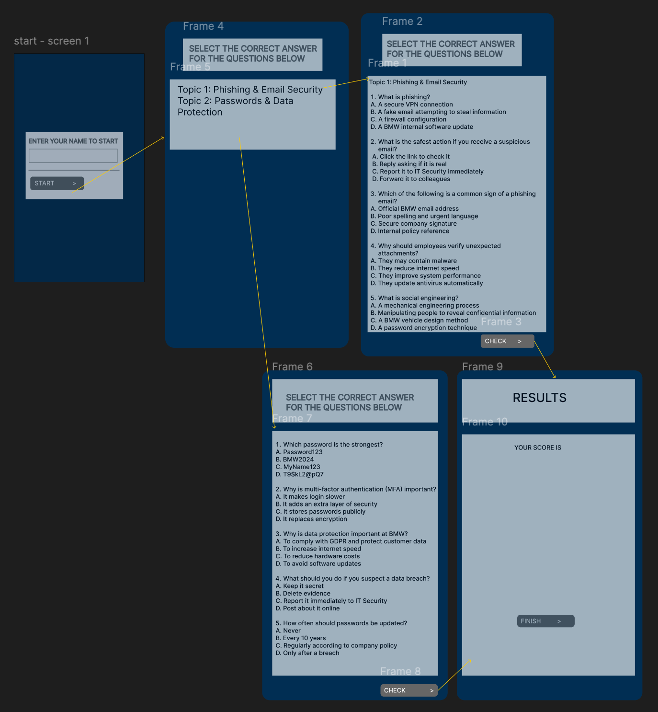

# Cyber Defence Quiz
## Introduction 
I currently work within the automotive manufacturing industry, which relies heavily on advanced machinery and digital technologies. The organisation relies on secure IT systems to support daily operations, including internal communication, manufacturing processes, and data management. As modern automotive environments become increasingly digitised, protecting sensitive data and systems has become essential. 

Due to the rapid growth of digitalisation within the industry, cybersecurity has become a critical factor in maintaining operational integrity and protecting company information. Employees must understand common cyber threats such as phishing, data breaches, and social engineering attacks. However, the training currently provided by the organisation often relies on static materials, which do not actively assess employee understanding or engagement. 

To address this issue, I decided to develop a Cyber Defence Quiz Minimum Viable Product (MVP). The application will allow users to select relevant cybersecurity topics, answer multiple-choice questions, and receive immediate feedback on their responses. The system will calculate scores automatically and store results in a CSV file to enable basic performance tracking and analysis. 

This MVP is relevant to the workplace as it provides an interactive and measurable approach to improving cybersecurity awareness among employees. By encouraging active participation and tracking individual performance, the application supports continuous digital skills development in a cost-effective and scalable manner.

## Design Section
### GUI Design 
The GUI was made using Figma to demonstrate the user interface and layout of the application before development begins. The design focuses on making it relevant to organisations' guidelines and layouts. The application will be using blue grey colour scheme as it matches the BMW brand style. The application will also be using calvice font format as it best matches the organisation's policies. The design focuses on simplicity, clarity, and ease of navigation to ensure an accessible user experience.

The user Journey can be seen in the image below:



You can clearly see the user journey in the image attached. The application will start off by asking you to enter your name so that the app will understand who is using it, and it will be easier to store the results. On the second screen, you allow users to select the topic they would like to learn about. On the next screen, as per the topic, it will display the multiple-choice questions for users to answer. On the last screen, they can see their results.

 ## Functional and Non-functional Requirements 

### Functional Requirement 

| ID | Requirement Description |
|----|--------------------------|
| FR1 | The application must allow the user to enter their name before starting the quiz. |
| FR2 | The application must allow the user to select a quiz topic. |
| FR3 | The application must load quiz questions from a CSV file based on the selected topic. |
| FR4 | The application must display one question at a time. |
| FR5 | The application must display four multiple-choice answer options for each question. |
| FR6 | The application must allow the user to select one answer using radio buttons. |
| FR7 | The application must validate whether the selected answer is correct. |
| FR8 | The application must calculate and track the user’s score. |
| FR9 | The application must display the final score and percentage at the end of the quiz. |
| FR10 | The application must save the user’s name, score, and percentage to a results CSV file. |
| FR11 | The application must prevent progression without selecting an answer. |
| FR12 | The application must display an error message if the question file is missing or invalid. |
| FR13 | The application must allow the user to exit the application safely. |

### Non-functional Requirement

| ID   | Requirement Description |
|------|--------------------------|
| NFR1 | The interface must be simple and easy to navigate. |
| NFR2 | The application must use clear fonts and readable colours. |
| NFR3 | The layout must remain consistent across all screens. |
| NFR4 | The system must respond to user input within 1 second. |
| NFR5 | The application must load questions without noticeable delay. |
| NFR6 | The system must not crash if invalid input is provided. |
| NFR7 | The system must handle missing or corrupted CSV files gracefully. |
| NFR8 | The quiz must correctly calculate scores without errors. |
| NFR9 | The application must follow object-oriented programming principles. |
| NFR10 | The code must be modular and structured into classes. |
| NFR11 | The system must include unit tests to verify quiz logic. |
| NFR12 | The system must run on Python 3.10 or higher. |
| NFR13 | The application must work on Windows and macOS environments. |

### Tech stack outline 

Python 3 - Programming Language

Tkinter - Graphical user interface 

Pillow (PIL) – for background image handling

CSV – the local data stored in CSV 

unittest – for automated unit testing

CSV files used to - Store quiz questions and store user results

Visual Studio Code - used to develop applications in 

Figma - used for UI prototyping

Digram.net - used for class diagram 

### Code Design Document


### Development Section 
This section will explain how the application works, breaking down the code in main modules and functions in the program. 

```
class Question:
 def __init__(self, text, options, correct):
        self.text = text
        self.options = options
        self.correct = correct.strip()
        
    def is_correct(self, answer):
        return answer.strip() == self.correct
 ```
 The code is dedicated to storing one quiz question and seeing if the user's answer is correct. It stored the 4 multiple choice answer options. It compares the user's answer with the correct one. It returns true or false depending on the correctness. 

 ```
# QUIZ CLASS 
class Quiz:
    def __init__(self, questions):
        self.questions = questions
        self.current = 0
        self.score = 0

    def get_question(self):
        return self.questions[self.current]

    def submit_answer(self, answer):
        if self.get_question().is_correct(answer):
            self.score += 1
        self.current += 1

    def finished(self):
        return self.current >= len(self.questions)
```
The code controls the quiz state, such as current question, score, progression and finished state. It stores the questions and initialises the current index and scores. checks correctness (via Question,is_correct) and increments score and index. Returns True if all questions have been answered. 

```
# LOAD QUESTIONS 
def load_questions(filename):
    questions = []

    if not os.path.exists(filename):
        messagebox.showerror("Error", f"{filename} not found.")
        return []

    with open(filename, newline="", encoding="utf-8") as file:
        reader = csv.reader(file)
        for row in reader:
            if len(row) == 6:
                questions.append(
                    Question(row[0], row[1:5], row[5])
                )

    return questions
```
The code parses topic files such as phishing.csv and Password.CSV to build the questions.
load_questions(filename)
Reads a CSV where each row is:
question_text, option1, option2, option3, option4, correct_answer
Creates and returns a list of Question objects.

```
def save_result(name, score, total):
    percentage = round((score / total) * 100, 2)

    with open("results.csv", "a", newline="", encoding="utf-8") as file:
        writer = csv.writer(file)
        writer.writerow([name, score, total, percentage])
```
The code appends the record to results.csv at the end of the quiz. the funtion in this code computes percentages and appends [name, score, total, recentage] to results.csv.

```
# SCREEN CONTROL 
def show_frame(frame):
    frame.tkraise()
```
This manages switching between the different frames (screens) using Tkinter.

### Quiz Flow 
In this code, you can see the quiz flow functions. 
```
# QUIZ FLOW 
def start_quiz(filename):
    global quiz
    questions = load_questions(filename)

    if not questions:
        return

    quiz = Quiz(questions)
    display_question()
    show_frame(quiz_frame)


def display_question():
    question = quiz.get_question()
    question_label.config(text=question.text)

    for i in range(4):
        option_buttons[i].config(
            text=question.options[i],
            value=question.options[i]
        )

    selected.set(None)


def submit_answer():
    answer = selected.get()

    if not answer:
        messagebox.showwarning("Warning", "Please select an answer.")
        return

    quiz.submit_answer(answer)

    if quiz.finished():
        show_result()
    else:
        display_question()


def show_result():
    name = name_entry.get()
    total = len(quiz.questions)

    save_result(name, quiz.score, total)

    percentage = round((quiz.score / total) * 100, 2)

    result_label.config(
        text=f"Final Score: {quiz.score}/{total}\nPercentage: {percentage}%"
    )

    show_frame(result_frame)


def go_to_topic():
    if name_entry.get().strip() == "":
        messagebox.showwarning("Warning", "Please enter your name first.")
        return

    show_frame(topic_frame)
```
### Functions in this section

start_quiz(filename)
Loads questions from a CSV, initializes Quiz, shows the first question, and navigates to the quiz screen.
display_question()
Binds the current question text to the question_label and sets all four radio button options. Clears previous selection.
submit_answer()
Validates that an option is selected, submits to the quiz, and either advances or shows results.
show_result()
Pulls the name, computes totals and percentage, saves to CSV via save_result, updates the result label, and shows the result screen.
go_to_topic()
Ensures the name is entered before allowing navigation to the topic selection screen


### GUI using the Tkinter framework

Key GUI Elements

Window: root = tk.Tk() - sets title, fixed size, no resize.
Background: PIL.Image - bmw_background.jpg resized to 700x500, used on every frame.

Frames (screens):

name_frame – name entry
topic_frame – topic selection
quiz_frame – question + options
result_frame – final score
All frames are layered and switched with show_frame.

Name screen widgets: Label, Entry (name_entry), Button (Submit)
Topic screen widgets: Two Buttons to start the quiz with Phishing.csv or Password.csv

question_label (multi-line, wrapped)
selected = tk.StringVar() to store the selected option
option_buttons - four RadioButtons bound to selected
Submit button - submit_answer

Result screen widgets:

result_label (final score and percentage)
Exit button - root. destroy

### Whole program execution

```
if __name__ == "__main__":
    show_frame(name_frame)
    root.mainloop()
```
This code raises the Name screen first and starts the Tk event loop (mainloop), so the UI is interactive.

### Constants and Globals Used 

Colour constants:
WHITE = "#FFFFFF"
GRAY = "#666666"

### Testing Section 

To ensure that the final product performs as planned and meets the requirements, I followed a strategic testing approach. My testing combined both manual testing and automated unit testing. Using both methods allowed me to identify functional issues, verify expected behaviour, and increase overall confidence in the stability of the application.  

### Manual Testing  

I used manual testing to verify: 

GUI behaviour (buttons, frames, navigation) 

User input handling (name entry, answer selection) 

CSV file loading 

Result calculations 

Error/warning messages 

Overall user experience 

Manual testing is essential for GUI applications because it validates that the user interface responds correctly to human interaction (e.g., clicking buttons, selecting options). It was one of the best choices as Tkinter’s GUI behaviour can only be fully validated through hands‑on interaction. It also ensures the application feels intuitive and bug‑free from the user’s point of view. 
 
Below is the table to summarise things I tested and their outcomes 

| Test Case ID | Description | Expected Result | Status |
|--------------|-------------|------------------|--------|
| TC-001 | Launch application window | Name screen loads successfully | Pass |
| TC-002 | Empty name validation | Warning popup appears asking for name |  Pass  |
| TC-003 | Valid name submission | User moves to topic selection screen |  Pass  |
| TC-004 | Load Topic 1 questions | First question is displayed without error | Pass  |
| TC-005 | Load Topic 2 questions | First question is displayed without error | Pass |
| TC-006 | Prevent submitting without answer | Warning popup appears | Pass |
| TC-007 | Correct answer scoring | Score increases by 1 | Pass |
| TC-008 | Wrong answer scoring | Score stays the same | Pass |
| TC-009 | Quiz progression | Moves to next question until finished | Pass |
| TC-010 | Display final score & percentage | Final results screen shows correct values | Pass |
| TC-011 | Save results to CSV | Entry is added to `results.csv` | Pass |
| TC-012 | Exit button closes app | Application closes successfully | Pass |
| TC-013 | Background image loading | Background visible on all screens | Pass |

### Unittesting  

Unit testing helps check that the important parts of the program work the way they should. In this quiz app, the tests make sure that answering questions, scoring, and moving to the next question all work correctly. This helps prevent mistakes in the program, even if you change or add new features later.

Am using Python’s built‑in unittest library because it is simple and already included with Python. This means you don’t need to install anything extra to run the tests. It works everywhere, on any computer that has Python, which makes things easier. unittest is also easy to understand. It uses clear test methods and simple checks like "is this true?" or "are these two things equal?" Because of this, even beginners can read and write tests without getting confused. Other testing tools exist, such as pytest, but they can be more complicated and require extra installation. For a small project like this quiz app, unittest is more than enough. It keeps things clean, simple, and easy to manage.

Below is an example of the unit test written for the Question class:

```
import unittest
from main import Question, Quiz


class TestQuestion(unittest.TestCase):

    def test_correct_answer(self):
        q = Question("Test?", ["A", "B", "C", "D"], "A")
        self.assertTrue(q.is_correct("A"))

    def test_wrong_answer(self):
        q = Question("Test?", ["A", "B", "C", "D"], "A")
        self.assertFalse(q.is_correct("B"))


class TestQuiz(unittest.TestCase):

    def setUp(self):
        self.questions = [
            Question("Q1", ["A", "B", "C", "D"], "A"),
            Question("Q2", ["A", "B", "C", "D"], "B")
        ]
        self.quiz = Quiz(self.questions)

    def test_score_increases_on_correct(self):
        self.quiz.submit_answer("A")
        self.assertEqual(self.quiz.score, 1)

    def test_score_not_increase_on_wrong(self):
        self.quiz.submit_answer("C")
        self.assertEqual(self.quiz.score, 0)

    def test_question_index_increases(self):
        self.quiz.submit_answer("A")
        self.assertEqual(self.quiz.current, 1)

    def test_finished(self):Below is an example of the unit test written for the Question class:

        self.quiz.submit_answer("A")
        self.quiz.submit_answer("B")
        self.assertTrue(self.quiz.finished())


if __name__ == "__main__":
    unittest.main()
    
```


## Documentation Section

### User Document 

The quiz application has been designed to provide employees with a simple, clear and interactive way to test their knowledge for cybersecurity topics. This part of the document explains how end users can navigate and interact with the quiz application, from launching the application to viewing the results. 

To begin, users simply open the application, which automatically loads the Name Entry Screen. Here, they must type their full name into the input box. This name is important, as it is later used to record quiz results. Once the name is entered, the user clicks the Submit button. If no name is provided, a warning message will appear to remind the user to enter one before continuing.

After submitting their name, users are taken to the Topic Selection Screen. The quiz currently includes multiple cybersecurity topics, such as “Phishing & Email Security” and “Passwords & Data Protection.” Users select a topic by clicking the appropriate button. This action loads the questions for that topic from the system’s CSV files.

Next, the user is taken to the quiz section, where each question is provided with a multiple-choice answer. Users must select one answer before clicking the submit button. If they attempt to submit without selecting an answer, the system displays a warning message. After submitting, the quiz automatically moves to the next question until all have been answered.

When the quiz is completed, the user is shown the Results Screen, where their total score and percentage are displayed. These results are also automatically saved to a file for record-keeping, allowing managers or HR to review staff performance.
Finally, the user can click Exit to close the application safely. The interface is designed to be intuitive, requiring no prior technical knowledge, making it suitable for all staff members.

## Evaluation Section

The application was developed to address the awareness of increasing cyber threats and crimes around the world and to increase awareness among the employees. The quiz was an engaging way to do that, which was a success as it met its core objectives. However, evaluating the project allows identification of strengths, limitations, and opportunities for future improvement. 

One of the key strengths of the quiz application is its simple and intuitive user interface. Users can quickly enter their name, choose a topic, and begin the quiz without prior technical knowledge. The use of Tkinter frames and clear navigation ensures that users do not feel overwhelmed. Additionally, the quiz system’s use of CSV files makes the content easy to update, allowing new questions to be added without modifying the main code. This design decision supports long-term flexibility and maintainability.

From a technical perspective, the quiz logic is accurate and reliable. The Question and Quiz classes perform well, and the unit tests confirmed that answer validation behaves correctly under different conditions. Manual testing also demonstrated that the application handles user mistakes effectively, such as submitting without selecting an answer or attempting to continue without entering a name. These built-in safeguards enhance the robustness and user friendliness of the system.

However, the application still has some limitations. Such as the lack of visual feedback, right now, beyond text, warning pop-ups anda  graphical background, the application does not have anything more engaging. Having more visuals will allow more engagement. Additionally, the system does not yet store historical results in a user profile or allow users to review answers after completing the quiz. Implementing these enhancements could further support learning outcomes for staff.

In summary, the Cyber Defence Quiz is a functional, reliable, and user-friendly product that meets its intended purpose. The evaluation highlights its strengths in usability and logic accuracy, while also identifying future improvements that could enhance interactivity and educational value.


