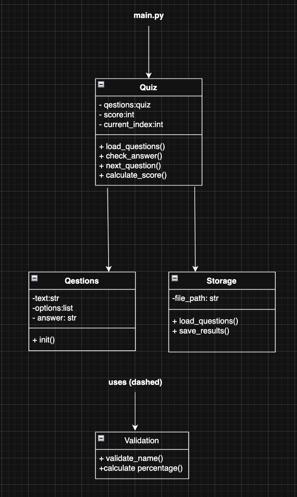

# Cyber Defence Quiz
## Introduction 
I currently work within the automotive manufacturing industry, which relies heavily on advanced machinery and digital technologies. The organisation depends on secure IT systems to support daily operations such as internal communication, manufacturing processes, and data management. As modern automotive environments become increasingly digitised, the protection of sensitive data and systems has become essential. 

Due to the rapid growth of digitalisation within the industry, cyber security has become a critical factor in maintaining operational integrity and protecting company information. Employees must understand common cyber threats such as phishing, data breaches, and social engineering attacks. However, the training currently provided by the organisation often relies on static materials, which do not actively assess employee understanding or engagement. 

To address this issue, I decided to develop a Cyber Defence Quiz Minimum Viable Product (MVP). The application will allow users to select relevant cyber security topics, answer multiple-choice questions, and receive immediate feedback on their responses. The system will calculate scores automatically and store results in a CSV file to enable basic performance tracking and analysis. 

This MVP is relevant to the workplace as it provides an interactive and measurable approach to improving cyber security awareness among employees. By encouraging active participation and tracking individual performance, the application supports continuous digital skills development in a cost-effective and scalable manner.

## Design Section
### GUI Design 
 the GUI was made using Figma to demonstarte the user interface and layout of the application before the development begins. the design focuses on making it relevent to organisations gudeline and layouts. The application will be using blue grey colour scheme as it matches the BMW brand style. The application will also be using calvice font formate as it best matches the organisations policies. The design focuses on simplicity, clarity, and ease of navigation to ensure an accessible user experience.

The user Journey can be seen in the image below:


you can clearly see the user journey in the image attched. 
the application will start off with asking you to enter your name so that app will understand who is using it and easier to store the results. on the second screen you allows users to select the topic they would like to learn about. on the next screen asper the topic it will display the multiple choice questions for users to answer. on the last screen they can see thier results.

 ## Functional and Non-functional Requirements 

### Functional Requirement 

| ID | Requirement Description |
|----|--------------------------|
| FR1 | The application must allow the user to enter their name before starting the quiz. |
| FR2 | The appplication must allow the user to select a quiz topic. |
| FR3 | The appplication must load quiz questions from a CSV file based on the selected topic. |
| FR4 | The appplication must display one question at a time. |
| FR5 | The appplication must display four multiple-choice answer options for each question. |
| FR6 | The appplication must allow the user to select one answer using radio buttons. |
| FR7 | The appplication must validate whether the selected answer is correct. |
| FR8 | The appplication must calculate and track the user’s score. |
| FR9 | The appplication must display the final score and percentage at the end of the quiz. |
| FR10 | The appplication must save the user’s name, score, and percentage to a results CSV file. |
| FR11 | The appplication must prevent progression without selecting an answer. |
| FR12 | The appplication must display an error message if the question file is missing or invalid. |
| FR13 | The appplication must allow the user to exit the application safely. |

### Non-functional Requirement

| ID   | Requirement Description |
|------|--------------------------|
| NFR1 | The interface must be simple and easy to navigate. |
| NFR2 | The application must use clear fonts and readable colours. |
| NFR3 | The layout must remain consistent across all screens. |
| NFR4 | The system must respond to user input within 1 second. |
| NFR5 | The application must load questions without noticeable delay. |
| NFR6 | The system must not crash if invalid input is provided. |
| NFR7 | The system must handle missing or corrupted CSV files gracefully. |
| NFR8 | The quiz must correctly calculate scores without errors. |
| NFR9 | The application must follow object-oriented programming principles. |
| NFR10 | The code must be modular and structured into classes. |
| NFR11 | The system must include unit tests to verify quiz logic. |
| NFR12 | The system must run on Python 3.10 or higher. |
| NFR13 | The application must work on Windows and macOS environments. |

### Tech stack outline 

Python 3 - Programming Language

Tkinter - Graphical user interface 

Pillow (PIL) – for background image handling

CSV – the local data stored in CSV 

unittest – for automated unit testing

CSV files used to - Store quiz questions and store user results

Visual Studio Code - used to develop application in 

Figma - used for UI prototyping

Digram.net - used for class diagram 

### Code Design Document




### Development Section 
This section will explain how the application works, breaking own the code in main modules and functions in the program. 

```
class Question:
 def __init__(self, text, options, correct):
        self.text = text
        self.options = options
        self.correct = correct.strip()
        
    def is_correct(self, answer):
        return answer.strip() == self.correct
 ```
 The code is dedicted to store one quiz qestion and see if the users answer is correct. it stored the 4 multiple choice answer options. It compares the users answer with the correct one. It returns true or false dpending on the correctness. 

 ```
# QUIZ CLASS 
class Quiz:
    def __init__(self, questions):
        self.questions = questions
        self.current = 0
        self.score = 0

    def get_question(self):
        return self.questions[self.current]

    def submit_answer(self, answer):
        if self.get_question().is_correct(answer):
            self.score += 1
        self.current += 1

    def finished(self):
        return self.current >= len(self.questions)
```
The code controles the quiz state such as current question,score,progression and finished state.It stores the questions and initialise the currect index and scores. checks correctness (via Question,is_correct) and increments score and index. Retunes True if all questions have been answered. 

```
# LOAD QUESTIONS 
def load_questions(filename):
    questions = []

    if not os.path.exists(filename):
        messagebox.showerror("Error", f"{filename} not found.")
        return []

    with open(filename, newline="", encoding="utf-8") as file:
        reader = csv.reader(file)
        for row in reader:
            if len(row) == 6:
                questions.append(
                    Question(row[0], row[1:5], row[5])
                )

    return questions
```
The code parses topic files such as phishing.csv and Password.CSV to build the questions.
load_questions(filename)
Reads a CSV where each row is:
question_text, option1, option2, option3, option4, correct_answer
Creates and returns a list of Question objects.

```
def save_result(name, score, total):
    percentage = round((score / total) * 100, 2)

    with open("results.csv", "a", newline="", encoding="utf-8") as file:
        writer = csv.writer(file)
        writer.writerow([name, score, total, percentage])
```
The code apprneds the record to results.csv at the end of the quiz. the funtion in this code computes percentages and apprends [name, score, total, recentage] to results.csv.

```
# SCREEN CONTROL 
def show_frame(frame):
    frame.tkraise()
```
This Manages switching between the different frames (screens) using Tkinter.

## Quiz Flow 
In this code you can see the quiz flow funtions. These functions orchestrate the quiz lifecycle: start → ask → submit → finish → results. 
```
# QUIZ FLOW 
def start_quiz(filename):
    global quiz
    questions = load_questions(filename)

    if not questions:
        return

    quiz = Quiz(questions)
    display_question()
    show_frame(quiz_frame)


def display_question():
    question = quiz.get_question()
    question_label.config(text=question.text)

    for i in range(4):
        option_buttons[i].config(
            text=question.options[i],
            value=question.options[i]
        )

    selected.set(None)


def submit_answer():
    answer = selected.get()

    if not answer:
        messagebox.showwarning("Warning", "Please select an answer.")
        return

    quiz.submit_answer(answer)

    if quiz.finished():
        show_result()
    else:
        display_question()


def show_result():
    name = name_entry.get()
    total = len(quiz.questions)

    save_result(name, quiz.score, total)

    percentage = round((quiz.score / total) * 100, 2)

    result_label.config(
        text=f"Final Score: {quiz.score}/{total}\nPercentage: {percentage}%"
    )

    show_frame(result_frame)


def go_to_topic():
    if name_entry.get().strip() == "":
        messagebox.showwarning("Warning", "Please enter your name first.")
        return

    show_frame(topic_frame)
```
Functions in this section

start_quiz(filename)
Loads questions from a CSV, initializes Quiz, shows first question, and navigates to the quiz screen.
display_question()
Binds current question text to question_label and sets all four radio button options. Clears previous selection.
submit_answer()
Validates that an option is selected, submits to Quiz, and either advances or shows results.
show_result()
Pulls the name, computes totals and percentage, saves to CSV via save_result, updates the result label, and shows the result screen.
go_to_topic()
Ensures name is entered before allowing navigation to the topic selection screen


GUI using Tkinter framework

Defines the main window, four frames (screens), the background image, and widgets.
Key GUI Elements

Window: root = tk.Tk() → sets title, fixed size, no resize.
Background: PIL.Image → bmw_background.jpg resized to 700x500, used on every frame.
Frames (screens):

name_frame – name entry
topic_frame – topic selection
quiz_frame – question + options
result_frame – final score
All frames are layered and switched with show_frame.

Name screen widgets: Label, Entry (name_entry), Button (Submit → go_to_topic)
Topic screen widgets: Two Buttons to start quiz with Phishing.csv or Password.csv
Quiz screen widgets:

question_label (multi-line, wrapped)
selected = tk.StringVar() to store selected option
option_buttons → four Radiobuttons bound to selected
Submit button → submit_answer

Result screen widgets:
result_label (final score and percentage)
Exit button → root.destroy

Whole prgram execution

```
if __name__ == "__main__":
    show_frame(name_frame)
    root.mainloop()
```
This code Raises the Name screen first and starts the Tk event loop (mainloop) so the UI is interactive.

### Testing Section 


